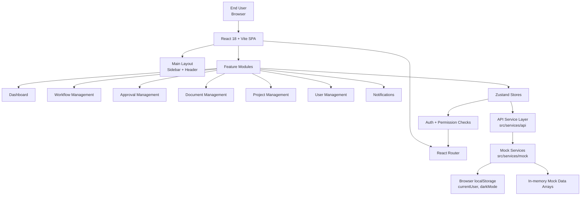
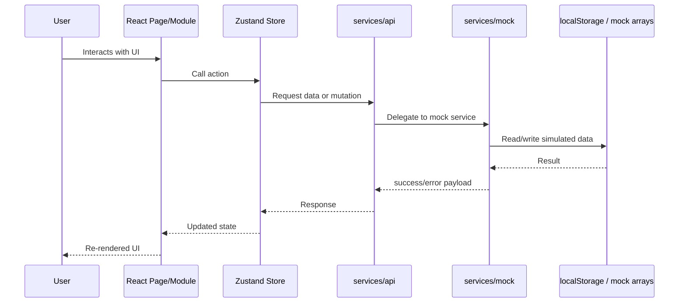
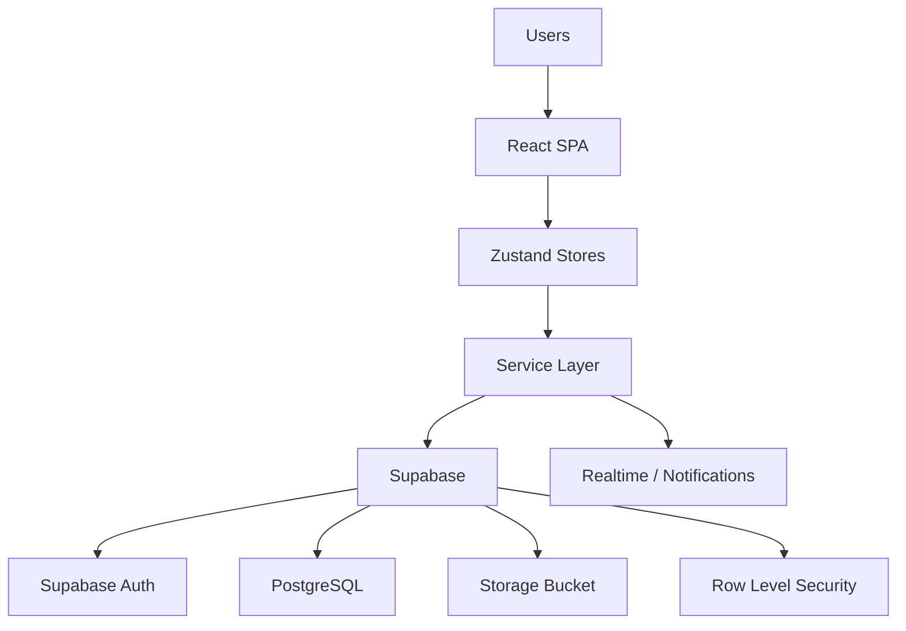

# Workflow ERP System Architecture

## 1. Current Architecture

This project is currently implemented as a **client-side single-page application**. There is **no real backend yet**. Business data is served through a **service abstraction layer** that currently delegates to **in-memory mock services**.

## 2. Runtime Layers

### Presentation layer
- `src/modules/*` contains feature pages and modals.
- `src/components/ui/*` contains reusable UI primitives.
- `src/app/layout/*` provides shared shell components.

### Navigation and access control
- `src/app/router/AppRouter.jsx` defines public and protected routes.
- Route guards depend on `useAuthStore()` state and permission checks.

### State management layer
- `src/app/store/*` contains Zustand stores for:
- `auth`
- `workflow`
- `approval`
- `project`
- `document`
- `notification`
- Each store handles loading state, API calls, and local state updates.

### Service abstraction layer
- `src/services/api/index.js` is the swap point for backend integration.
- Today it re-exports mock services as `userApi`, `workflowApi`, `approvalApi`, and others.

### Data layer
- `src/services/mock/*` simulates async operations with `setTimeout`.
- Most records are stored in module-level arrays, so data resets on reload.
- Authentication persistence uses `localStorage` for `currentUser`.
- UI preference persistence uses `localStorage` for `darkMode`.

## 3. Core Data Flow

## 4. Implemented Security Model

- Authentication is simulated in `authStore` via `userApi.login(...)`.
- Authorized user state is restored from `localStorage` on app startup.
- Access control is enforced in the router with:
- `ProtectedRoute`
- `PublicRoute`
- `PermissionRoute`
- Role permissions are currently defined client-side in `authStore.js`.

## 5. Important Architectural Limitation

The current system is best described as a **frontend prototype with a backend-ready structure**, not a full multi-tier deployed ERP platform.

Limitations:
- No database
- No server/API runtime
- No real file storage
- No real-time transport
- No server-side authorization enforcement
- Mock data is mostly ephemeral

## 6. Target Architecture For Next Phase

The codebase is already structured to evolve into this:

## 7. Recommended One-Line Description

**Workflow ERP is a modular React single-page application that uses Zustand for state management, React Router for protected navigation, and a service abstraction layer backed by mock services, with a clear migration path to a Supabase-backed architecture.**
